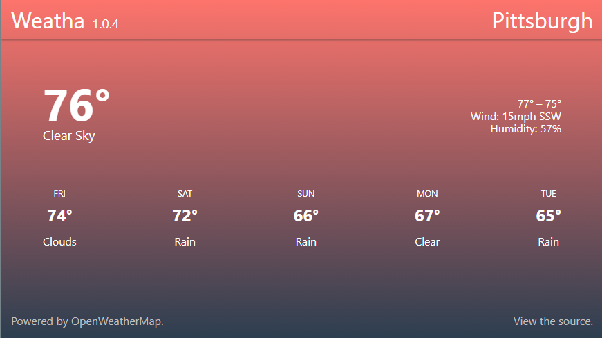

# [Weatha, v1.1.1](https://paulmakesthe.net/weatha/)
Simple weather app built with NPM, Gulp, CoffeeScript, Pug, and Sass. The weather information comes from [Dark Sky](https://darksky.net/poweredby/), weather icons are [Skycons](https://darkskyapp.github.io/skycons/), also from Dark Sky.

### To run:
Clone / download then enter the directory. Run `npm install` to install dependencies, `npm start` to generate the `dist\` folder, and then poll for changes. Now open `http://localhost:8080`!
