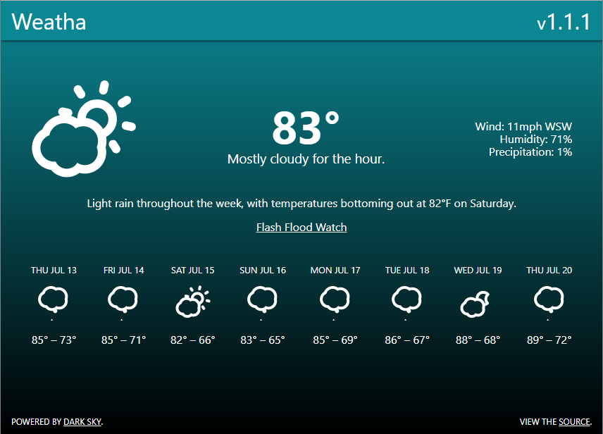

# Weatha
Simple weather app built with `npm`, `gulp`, CoffeeScript, Pug, and Sass; v1.0.6

### To run:
Clone / download then enter the directory. Run `npm install` to install dependencies, `npm start` to generate the `dist\` folder, and then poll for changes. Now open `http://localhost:8080`!
